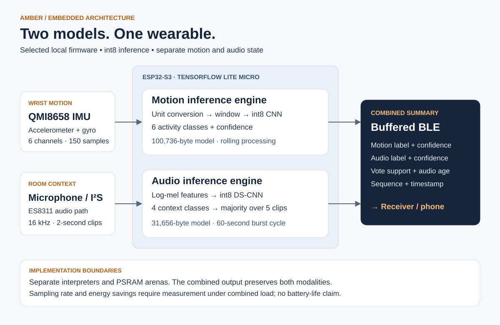

# System architecture

[← Portfolio](../README.md)

## Runtime data paths

**Motion.** The QMI8658 accelerometer/gyroscope supplies six channels. `ImuInferenceEngine` configures a 62.5 Hz sensor output rate and a nominal 20 ms software sampling period, converts accelerometer readings to m/s² and gyroscope readings to rad/s, and maintains a 150-sample rolling window. It quantizes inputs, invokes the six-class model, converts logits to probabilities, and exposes the top class and confidence. The combined source attempts inference after each new sample once the window is full, and publishes after every ten accepted samples.

**Audio.** An ES8311/I²S microphone path uses Arduino as an ESP-IDF component. Each 2-second, 16 kHz clip becomes a normalized 40 × 101 log-mel tensor. The active model is the device-fine-tuned int8 classifier. A FreeRTOS task starts after a 5-second delay and requests five successive windows on a 60-second start-to-start schedule. The summary records the majority label, mean confidence among supporting windows, support count, timestamps and sequence number.

**Reporting.** The foreground loop reads the latest audio summary when an IMU prediction is published. The payload carries both modalities separately, plus the age of the audio result. `amber_ble.c` buffers records and opens discovery/drain windows using queue-depth and age thresholds. The intended consumer is a BLE receiver/phone; this release does not establish a completed phone-side integration.

## Memory and scheduling decisions

- The models have separate TensorFlow Lite Micro interpreters and arenas.
- Each implementation reserves **2,048,000 bytes** for its tensor arena, preferring PSRAM. This is a reservation, not measured use or model size.
- The standalone audio notes record about **89,836 bytes of used TFLM arena**. Audio buffers, BLE storage, stacks and other allocations are additional.
- Audio summaries are protected by a mutex. The IMU remains serviced by the main loop while audio bursts run in a task.
- BLE queue capacity is 1,024 records; the operational budget is 300, with flushing requested above 210 records or at a five-minute age cap. This age cap triggers a radio attempt; it is not a guaranteed delivery deadline without a receiver.

## Timing boundaries worth measuring next

The **20 ms period is a target**, not demonstrated sustained 50 Hz sampling under combined load. Historical IMU `Invoke()` time is about 30 ms, and the loop invokes synchronously after each accepted sample; that work can stretch the acquisition cadence. The 150-sample input therefore represents a nominal three-second window, not a guaranteed three-second interval in this implementation.

Likewise, five 2-second audio clips require at least ten seconds of capture plus frontend and inference time. The schedule reduces how often a burst is requested; there is no measured battery-life claim and no proof that the microphone/codec is powered down between bursts.

The next integration benchmark should log accepted-sample timestamps, frontend and `Invoke()` times, missed deadlines, peak internal/PSRAM use, BLE drops, and current draw under simultaneous operation.

## Label and version boundaries

Older planning documents list seven supervised IMU classes plus `unknown`. The included deployment has **six output classes**; `social_gesture` is absent. The standalone audio engine has a synthetic `quiet` gate, but the combined `run_burst()` path invokes the four-class classifier directly. The architecture and model manifest follow the actual selected artifacts.

Sources: [main scheduler](../src/firmware/main.cpp), [IMU engine](../src/firmware/imu_inference_engine.cpp), [audio engine](../src/firmware/audio_context_engine.cpp), [BLE queue](../src/firmware/amber_ble.c).
