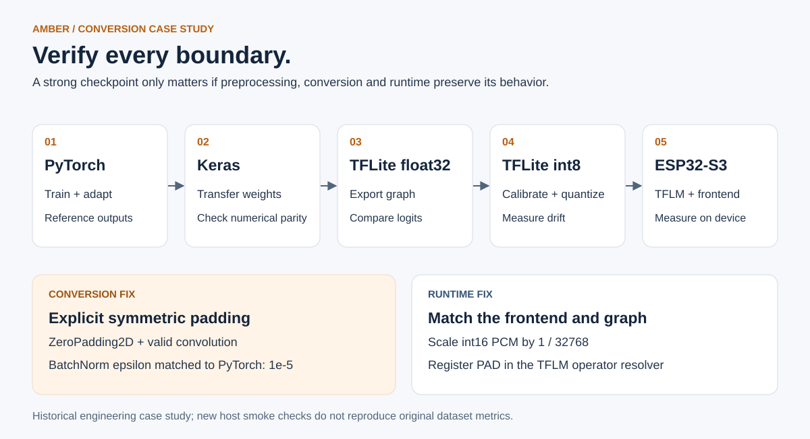

# Case study: a good checkpoint, a broken deployment

[← Portfolio](../README.md)

The first audio deployment behaved poorly despite useful training metrics. The debugging work separated checkpoint quality from conversion and runtime behavior rather than treating every failure as a training problem.

## Isolating the mismatch

The project record describes a progression through the raw PyTorch checkpoint, a reconstructed Keras model, float32 TFLite, int8 TFLite, and finally the firmware frontend/runtime. Raw checkpoint evaluation pointed to the conversion path as the immediate fault.

Two reconstruction details mattered:

1. **Padding semantics.** Strided PyTorch convolutions with explicit symmetric padding were not equivalent to the initial Keras `same` configuration. The corrected model uses `ZeroPadding2D` followed by `valid` convolutions: two samples on each side for the 5 × 5 stem and one for the 3 × 3 depthwise blocks.
2. **BatchNorm epsilon.** Keras reconstruction now explicitly uses `epsilon=1e-5`, matching the PyTorch network rather than the Keras default.

The corrected graph introduced `PAD`, requiring registration in the TFLM operator resolver. Firmware preprocessing also scales signed int16 PCM by `1/32768` before the spectral frontend. Matching the trained numerical input convention matters as much as loading the right weights.

## Inspect the implementation

- [Audio Keras reconstruction and conversion](../src/export/build_audio_context_tflite.py): explicit padding, epsilon, checkpoint weight transfer and representative-data conversion.
- [Original audio model definitions](../src/audio/model.py): the source network architecture.
- [Firmware frontend and resolver](../src/firmware/audio_context_engine.cpp): PCM scaling, log-mel extraction, quantization and `AddPad()`.
- [Recorded conversion report](../evidence/audio_conversion_report.json): float and integer comparisons from the project artifact.

The historical notes report PyTorch/Keras agreement around 1e-6 after the fix and meaningful live predictions on the watch. The included conversion report measures Keras/TFLite differences; it does not independently reproduce every link of that historical parity claim.
